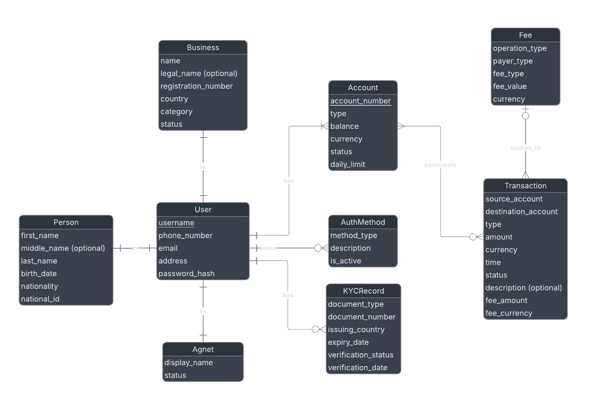
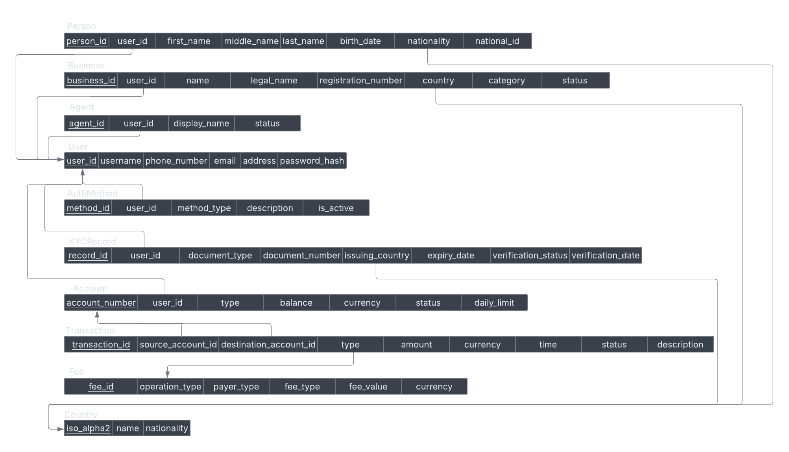
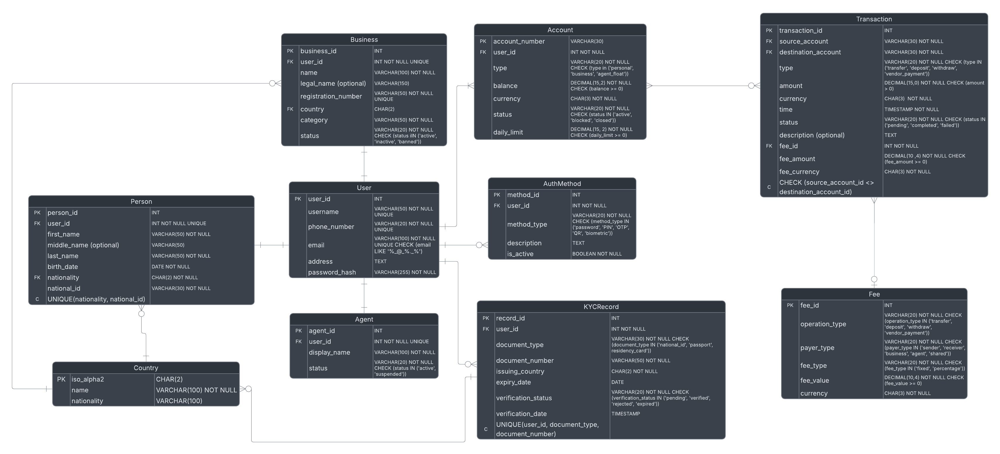

# Digital Wallet DB

**Project Type:** Course Project (Database Layer)

**Student:** Abdurrahman Al-Hariri  
**Student ID:** 6068  
**Course:** Database Systems  
**Instructor:** M. Aoude  
**Faculty:** Lebanese University - Faculty of Engineering (ULFG III)  
**Semester:** Fall 2025-2026

---

## Overview

This project implements a Digital Wallet system that allows users to manage their funds, perform transactions, and track account activity securely. It is built as part of the Database Systems course and demonstrates practical use of database design, queries, and data management.

---

## Problem & Use Case

Many digital wallets depend on banks or third-party platforms, which can limit control, accessibility, and flexibility. This project implements an **independent, closed-loop Digital Wallet system**, where all transactions happen internally without relying on external financial institutions.  

Users can:

- Deposit or withdraw money via an agent  
- Transfer funds to other users  
- Pay businesses within the system  

### Target Industry

- FinTech and digital payment solutions  
- Small businesses and local vendors  
- Communities or organizations needing internal payment systems

---

## Functional Requirements

1. The system shall allow persons and businesses to register, and to sign in and out, so they can access their wallet accounts.  
2. The system shall allow a signed-in user to create and manage one or more wallet accounts linked to their profile.  
3. The system shall allow users to complete KYC verification using identity documents before accessing higher limits and sensitive operations.  
4. The system shall allow users to deposit and withdraw money to and from their wallet accounts through authorized agents under the applicable KYC and authentication rules.  
5. The system shall allow users to send money between wallet accounts (peer-to-peer and to business accounts) under sufficient balance and authentication constraints.  
6. The system shall allow users to view their current account balances and transaction history for each account they own.  
7. The system shall allow agents to perform deposit and withdrawal operations on behalf of users under successful verification of the user's account and identity.  
8. The system shall allow businesses to receive payments into their wallet accounts for goods or services under the configured fee rules.  
9. The system shall allow the platform to calculate and apply fees to transactions according to predefined fee rules by operation type, payer, and amount.  
10. The system shall allow users to authenticate and authorize operations using multiple supported methods (e.g., password, PIN, OTP, QR-based authorization) according to their configured methods.  

## Non-Functional Requirements

1. The system shall ensure ACID properties for financial operations, especially for balance updates and transaction recording.  
2. The system shall protect against unauthorized access and common attacks by enforcing secure authentication, authorization, and encrypted communication and storage of sensitive data.  
3. The system shall expose a stable, versioned API for integration with other applications, with proper rate limiting, error handling, and backward compatibility.  
4. The system shall provide a simple and easy-to-use user interface for persons, agents, and businesses, and shall handle at least 50 concurrent users while answering balance and history queries within 2 seconds under normal load.  

> Note: These requirements represent the conceptual system design. The current implementation focuses on the database layer.

---

## ERD (Entity-Relationship Diagrams)

The database is designed to support a closed-loop Digital Wallet system, managing users, accounts, transactions, and businesses. ERDs are presented at three levels:

### Conceptual ERD

High-level entities with key attributes included:

- **User** – stores user details (name, email, etc.)  
- **Account** – tracks balances, account status, and type  
- **Transaction** – records deposits, withdrawals, transfers, and payments  
- **Business** – represents businesses that can receive payments  
- **Agent** – handles deposits and withdrawals  



### Logical ERD

Expands the conceptual design with primary keys, foreign keys, and relationships, independent of a specific DBMS.



### Physical ERD

Represents actual tables, data types, and constraints in the implemented database.



---

## File Structure

- `00_database_init.sql` – Database creation and initialization  
- `01_tables.sql` – Definition of core tables  
- `02_constraints_indexes.sql` – Primary keys, foreign keys, constraints, indexes  
- `03_seed_data.sql` – Initial sample data  
- `04_views.sql` – Database views  
- `05_functions.sql` – User-defined functions  
- `06_procedures.sql` – Stored procedures for wallet operations  

---

## Database Design / Implementation

The Digital Wallet system is implemented as a **closed-loop relational database** using SQL Server (T-SQL), where all transactions are processed internally without external dependencies.

The implementation includes:

- **Core tables** for Users, Accounts, Transactions, Businesses, and Agents  
- **Constraints and indexes** to enforce data integrity and optimize performance  
- **Views** to simplify data access and reporting  
- **User-defined functions** to encapsulate reusable logic  
- **Stored procedures** to handle transactional operations such as deposits, withdrawals, transfers, and payments

---

## Technologies Used

- **SQL Server (T-SQL)** – Database engine and query language for implementing tables, relationships, and transactions.  
- **Visual Studio Code (VS Code)** – Main IDE used to write and execute SQL scripts.  
- **Git & GitHub** – Version control and repository hosting for project files.  

---

## Setup / Installation / Usage

Follow these steps to set up the Digital Wallet database system:

1. **Clone the repository**

```bash
git clone https://github.com/your-username/your-repo.git
cd your-repo
```

2. **Set up the database in VS Code**

- Open VS Code and connect to your SQL Server instance using the SQL Server extension.  
- Execute the SQL scripts in order, from `00_database_init.sql` to `06_procedures.sql`.
  - This will create the database, tables, relationships, and populate initial data.

3. **Verify the setup**

- Ensure all tables are created correctly.  
- Check that sample data is inserted as expected.

---

## Usage Notes

- This is a database-only project (no UI or application layer).
- All interactions are done via SQL queries and stored procedures.
- Seed data allows immediate testing after setup.

---

## Conclusion and Future Work

This Digital Wallet project demonstrates a closed-loop system for internal money management, allowing users to deposit, withdraw, transfer funds, and pay businesses without relying on external banks or platforms.  

Future enhancements could include:  

- Adding a web or mobile interface for users and agents.  
- Implementing authentication and security features (e.g., encryption, access control).  
- Generating reports or analytics on transactions.  
- Expanding the system for multi-currency support or additional payment types.  
- **Integrating NoSQL databases** for flexible data storage or high-volume transaction logging.  
- **Leveraging AI/ML techniques** for fraud detection, transaction prediction, or personalized user recommendations.
- Designing and exposing a secure, versioned RESTful API to allow external applications (web/mobile) to interact with the Digital Wallet system.
